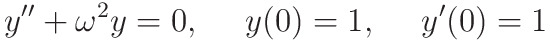

# Classiq's Q-SITE 2024 Open Challenge

The progress in quantum computing over the past few years has been notable, with increasing
technology being developed for quantum computers annually. In this context, there are quantum
computers with hundreds of qubits capable of running quantum algorithms with circuit depths of
up to several thousand gates while still producing significant results. A primary challenge in this
field is the creation of efficient and innovative quantum algorithms that provide exponential
speedups over classical methods. One notable example of such an algorithm is 
"[A Quantum Algorithm for Solving Linear Differential Equations: Theory and Experiment](https://journals.aps.org/pra/abstract/10.1103/PhysRevA.101.032307)", presented by Tao Xin, et al. in 2020.

Like most quantum algorithms papers, this is theoretical work. Implementing a theoretical paper
in practice is a massive challenge, with many obstacles that need to be overcome, both
theoretically and implementation-wise.

**Your challenge is to implement the above paper using the Classiq platform.**

Classiq is an end-to-end quantum software platform that enables you to design, optimize,
analyze and execute quantum algorithms. Classiq utilizes the power of high-level functional
design and enables you to focus on the algorithm you want to create rather than on its quantum
circuit implementation.

The goal is to apply the above algorithm to a simple differential equation. For this, you should
solve the harmonic oscillator equation, with frequency $\omega = 1$.

After solving this equation using the algorithm, you should:
1. Use the output as a means to evaluate the kinetic and potential energy of the system as
a function of time in the interval $[0, 1]$.
2. Analyze how the kinetic and potential energy values vary when you try different values
for the bounds in functions that require it (for example, the `inplace_prepare_state()`).
3. Analyze the count gate when optimizing the circuit in width or depth.

## What you need to submit
1. Final presentation that explains your solution and your implementation
2. The jupyter notebook you worked with
3. The .qmod files that capture your models (a detailed explanation of how to do this can
be found in [this notebook](https://github.com/iQuHACK/2024_Classiq/blob/main/classiq_challenge.ipynb))
4. The .qprog files that captures your quantum programs (a detailed explanation of how to
do this can be found in [this notebook](https://github.com/iQuHACK/2024_Classiq/blob/main/classiq_challenge.ipynb))

TODO: Replace with files in current GitHub repo!

## Submission details
1. TODO

### Submission tutorial

TODO: Add tutorial video

## Getting Started
If you are new to Classiq, we recommend starting with these guiding materials:
1. [Classiq 101](https://docs.classiq.io/latest/classiq_101/) will give you a smooth start with the platform and a general understanding of its concepts.
2. The one-hour-long [Classiq Fundamentals Workshop](https://www.youtube.com/watch?v=k9Lqz6r-8A4&list=PL_wGNAk5B0pXq98BJBKsbNH2Qjp1lk8dG&index=17) covers the basics of Classiq,
including some hands-on exercises to get you started.
3. The walkthrough on [the platform home page](https://platform.classiq.io/) will give you a tour of the platform and its
architecture.

Good luck!

(A PDF version of the same documentation in this `README` has been provided too.)